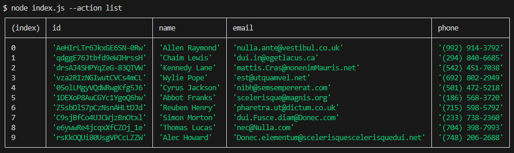
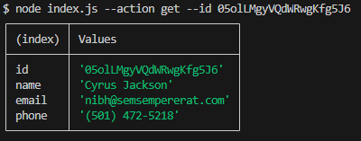
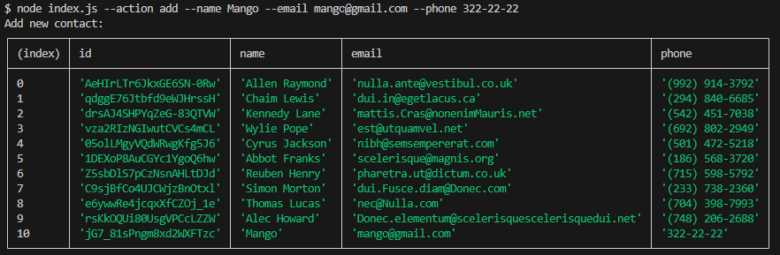

# Otrzymujemy i wyprowadzamy całą listę kontaktów w postaci tabeli (console.table)

```shell
node index.js --action list
```



# Otrzymujemy kontakt po id

```shell
node index.js --action get --id 05olLMgyVQdWRwgKfg5J6
```



# Dodajemy kontakt

```shell
node index.js --action add --name Mango --email mango@gmail.com --phone 322-22-22
```



# Usuwamy kontakt

```shell
node index.js --action remove --id qdggE76Jtbfd9eWJHrssH
```


